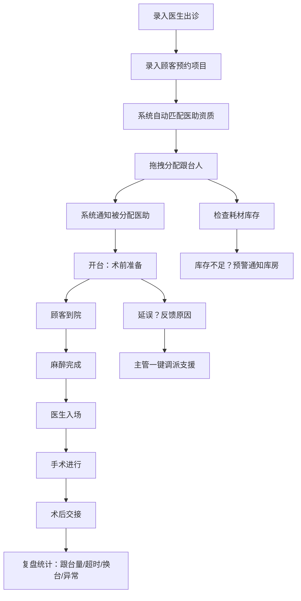

## 1. 产品概述
医美跟台排班与协同看板——面向运营院长、护士长和科室主管的实时协同系统，解决多医生、多治疗间同时开台时「谁跟哪台、缺什么、卡在哪」的核心痛点，实现排班-开台-复盘全流程数字化。

## 2. 核心功能

### 2.1 用户角色
| 角色 | 注册方式 | 核心权限 |
|------|----------|----------|
| 运营院长 | 管理员分配 | 全页面查看、排班调整、复盘统计查看、调派支援 |
| 护士长 | 管理员分配 | 排班日历管理、人员状态查看、耗材预警处理、拖拽调整跟台人 |
| 科室主管 | 管理员分配 | 房间看板监控、进度跟踪、延误反馈处理、一键调派支援 |
| 医助/护士 | 管理员分配 | 查看个人排班、反馈延误原因、确认通知、耗材提报 |

### 2.2 功能模块
1. **排班日历页**：医生出诊录入、顾客预约项目、预计时长和房间占用、医助资质自动匹配与提示
2. **房间看板页**：治疗间实时状态、手术进度阶段显示、拖拽调整跟台人、同步通知
3. **人员状态页**：全院医助/护士实时状态、资质标签、一键调派支援
4. **耗材预警页**：耗材库存监控、不足提醒库房、项目耗材关联、预警阈值管理
5. **复盘统计页**：按人/医生/项目统计跟台量、超时台次、临时换台、异常记录

### 2.3 页面详情
| 页面名称 | 模块名称 | 功能描述 |
|----------|----------|----------|
| 排班日历 | 日历视图 | 周/日视图切换，显示医生出诊时段、房间占用、已排跟台人 |
| 排班日历 | 出诊录入 | 录入医生出诊时间、顾客预约项目、预计时长、指定房间 |
| 排班日历 | 医助匹配 | 根据项目类型（眼鼻手术/光电/注射）自动匹配有对应资质的医助，高亮推荐 |
| 排班日历 | 拖拽排班 | 拖拽医助到对应台次，拖拽后自动发送通知给本人 |
| 房间看板 | 房间状态卡片 | 每个治疗间一张卡片，显示当前状态（空闲/准备中/手术中/术后交接） |
| 房间看板 | 进度阶段条 | 显示：术前准备→顾客到院→麻醉完成→医生入场→手术中→术后交接，实时高亮当前阶段 |
| 房间看板 | 延误反馈 | 医助可点击反馈延误原因，弹窗选择或输入，同步显示在看板上 |
| 房间看板 | 一键调派 | 主管可点击调派按钮，弹出可选空闲人员列表，一键指派支援 |
| 人员状态 | 人员列表 | 全院医助/护士卡片视图，显示当前状态（空闲/跟台中/休息/请假） |
| 人员状态 | 资质标签 | 每人显示资质标签（眼鼻手术/光电/注射/麻醉等），颜色区分 |
| 人员状态 | 快速筛选 | 按资质、状态、科室筛选人员 |
| 人员状态 | 调派支援 | 选中空闲人员，拖拽或点击指派到指定台次 |
| 耗材预警 | 库存列表 | 显示所有耗材当前库存、预警阈值、安全/预警/缺货三级状态 |
| 耗材预警 | 项目耗材关联 | 每个项目关联所需耗材列表，排班时自动检查是否充足 |
| 耗材预警 | 预警通知 | 库存低于阈值时，红标高亮并提示库房补货 |
| 耗材预警 | 提报申请 | 医助可提报耗材申请，自动通知库房 |
| 复盘统计 | 跟台量统计 | 按人员/医生/项目维度的跟台量柱状图和表格 |
| 复盘统计 | 超时台次 | 列出当日超时台次详情，超时时长、原因标注 |
| 复盘统计 | 临时换台 | 记录当日临时换台次数及原因 |
| 复盘统计 | 异常记录 | 汇总当日延误、耗材不足、人员调派等异常事件 |

## 3. 核心流程

**排班流程**：运营院长或护士长在排班日历中录入医生出诊信息→系统根据项目自动匹配有对应资质的医助→拖拽分配跟台人→系统自动通知被分配的医助

**开台协同流程**：科室主管在房间看板监控→术前准备阶段开始→顾客到院确认→麻醉完成→医生入场→手术进行→术后交接→每个阶段由跟台医助点击推进→如有延误点击反馈原因→主管收到延误通知可一键调派支援

**耗材预警流程**：排班录入项目时系统自动检查关联耗材库存→库存低于阈值触发预警→预警信息推送给库房→库房补货或医助提报申请

**复盘流程**：下班前系统自动汇总当日数据→按人/医生/项目统计跟台量→标记超时台次和临时换台→记录异常事件→生成次日晨会复盘报告

## 4. 用户界面设计

### 4.1 设计风格
- **主色调**：深邃靛蓝（#1B2A4A）作为主背景色，搭配暖白（#F8F6F3）卡片底色，营造专业医疗氛围
- **强调色**：珊瑚橙（#E8634A）用于预警和重要操作，翡翠绿（#2ECC71）用于完成/正常状态，琥珀黄（#F5A623）用于待处理/注意状态
- **按钮风格**：圆角8px，主按钮实心填充，次按钮描边，hover时有轻微上浮阴影
- **字体**：标题使用 Noto Serif SC 衬线体彰显专业感，正文使用 Noto Sans SC 无衬线体保证可读性
- **布局风格**：左侧导航栏 + 顶部标题栏，内容区域卡片式布局，网格化排列
- **图标风格**：线性图标（Lucide），2px描边，与整体简洁专业风格一致

### 4.2 页面设计概览
| 页面名称 | 模块名称 | UI 元素 |
|----------|----------|---------|
| 排班日历 | 日历视图 | 周视图7列网格，日视图时间轴纵排，时段块用颜色区分医生/项目类型 |
| 排班日历 | 出诊录入 | 右侧滑出抽屉表单，下拉选择医生/项目/房间，时长滑块 |
| 排班日历 | 医助匹配 | 推荐医助卡片列表，资质标签彩色胶囊，匹配度星级 |
| 排班日历 | 拖拽排班 | 医助头像可拖拽，拖入时段块时高亮放置区域，拖入后弹出确认 |
| 房间看板 | 房间卡片 | 网格布局，每卡片含房间号、医生名、项目名、进度条、跟台人头像 |
| 房间看板 | 进度阶段条 | 横向6段进度条，当前阶段高亮脉冲动画，已完成段实心填充 |
| 房间看板 | 延误反馈 | 点击弹出模态框，预设原因快速选择+自定义输入 |
| 房间看板 | 一键调派 | 点击调派按钮弹出浮层，列出当前空闲且资质匹配人员，点击即指派 |
| 人员状态 | 人员卡片 | 头像+姓名+状态徽章+资质标签，状态用颜色边框区分 |
| 人员状态 | 筛选栏 | 顶部横向筛选条，资质/状态/科室下拉选择 |
| 耗材预警 | 库存列表 | 表格形式，库存数量进度条，预警/缺货行红底高亮 |
| 耗材预警 | 预警卡片 | 顶部统计卡片：安全数/预警数/缺货数，配色区分 |
| 复盘统计 | 图表区 | 柱状图/折线图展示跟台量趋势，饼图展示异常分类占比 |
| 复盘统计 | 数据表格 | 可排序表格，超时标红，换台标黄，支持导出 |

### 4.3 响应式设计
- 桌面优先设计，最小宽度1280px
- 排班日历和房间看板在大屏下充分利用空间显示更多信息
- 平板端（768-1280px）侧边栏收起为图标模式
- 移动端不作为主要适配目标，但保证核心信息可读

### 4.4 3D 场景指导
- 不适用
