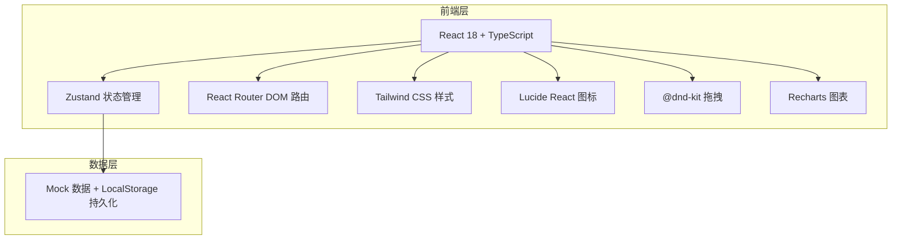
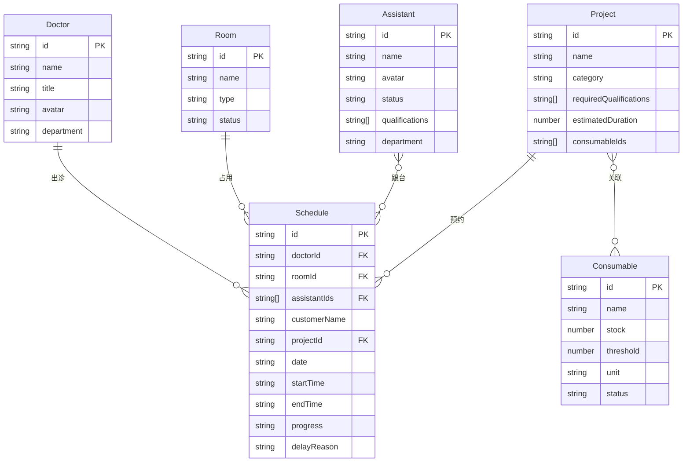

## 1. 架构设计



## 2. 技术说明
- **前端**：React@18 + TypeScript + Tailwind CSS@3 + Vite
- **初始化工具**：vite-init
- **后端**：无（纯前端项目，使用 Mock 数据）
- **数据库**：无（使用 LocalStorage 做数据持久化）
- **状态管理**：Zustand
- **路由**：React Router DOM v6
- **拖拽**：@dnd-kit/core + @dnd-kit/sortable
- **图表**：Recharts
- **图标**：lucide-react
- **日期处理**：date-fns

## 3. 路由定义
| 路由 | 用途 |
|------|------|
| / | 重定向到 /calendar |
| /calendar | 排班日历页面 |
| /rooms | 房间看板页面 |
| /staff | 人员状态页面 |
| /consumables | 耗材预警页面 |
| /review | 复盘统计页面 |

## 4. API 定义
纯前端项目，无后端 API。所有数据通过 Mock 数据初始化，存储在 Zustand store 中，使用 LocalStorage 持久化。

## 5. 服务端架构图
不适用（纯前端项目）

## 6. 数据模型

### 6.1 数据模型定义



### 6.2 数据定义语言

**Doctor（医生）**
```typescript
interface Doctor {
  id: string;
  name: string;
  title: string;
  avatar: string;
  department: string;
}
```

**Assistant（医助/护士）**
```typescript
interface Assistant {
  id: string;
  name: string;
  avatar: string;
  status: 'idle' | 'busy' | 'break' | 'leave';
  qualifications: ('eye_nose' | 'laser' | 'injection' | 'anesthesia')[];
  department: string;
}
```

**Room（治疗间）**
```typescript
interface Room {
  id: string;
  name: string;
  type: 'operating' | 'laser' | 'injection';
  status: 'idle' | 'preparing' | 'in_progress' | 'handover';
}
```

**Schedule（排班/台次）**
```typescript
interface Schedule {
  id: string;
  doctorId: string;
  roomId: string;
  assistantIds: string[];
  customerName: string;
  projectId: string;
  date: string;
  startTime: string;
  endTime: string;
  progress: 'preparing' | 'arrived' | 'anesthesia_done' | 'doctor_in' | 'operating' | 'handover';
  delayReason?: string;
  isOvertime: boolean;
  isSwapped: boolean;
  anomalyNotes: string[];
}
```

**Project（项目）**
```typescript
interface Project {
  id: string;
  name: string;
  category: 'eye_nose' | 'laser' | 'injection';
  requiredQualifications: ('eye_nose' | 'laser' | 'injection' | 'anesthesia')[];
  estimatedDuration: number;
  consumableIds: string[];
}
```

**Consumable（耗材）**
```typescript
interface Consumable {
  id: string;
  name: string;
  stock: number;
  threshold: number;
  unit: string;
  status: 'safe' | 'warning' | 'out_of_stock';
}
```
